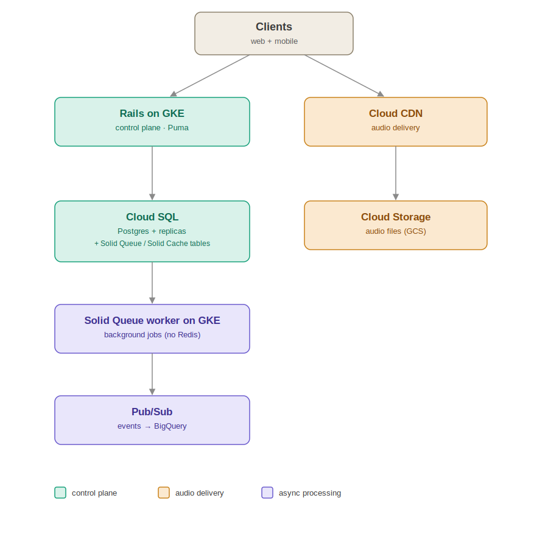

# Music Streamer

[](https://github.com/abhsss96/Music-Streamer/actions/workflows/ci.yml)
[](https://hub.docker.com/r/abhsss/music-streamer)
[](https://hub.docker.com/r/abhsss/music-streamer)
[](https://hub.docker.com/r/abhsss/music-streamer)
[](.ruby-version)
[](Gemfile)

API-only Rails backend for a music streaming platform. Rails is the control
plane only: it handles auth, catalog, playlists, search, and issuing
short-lived signed URLs for audio. It never streams audio bytes itself --
clients fetch audio directly from object storage (MinIO locally, a
GCS/S3-compatible bucket behind a CDN in production) using the signed URL.



## Stack

- Ruby 3.4.4, Rails 8.1 (API-only)
- PostgreSQL
- Solid Queue / Solid Cache (database-backed background jobs and caching --
  no Redis)
- `aws-sdk-s3` against a configurable S3-compatible endpoint
- RSpec, FactoryBot, Shoulda Matchers

## Running locally with Docker (recommended)

```
docker compose up --build
docker compose exec web bin/rails db:seed
```

This starts:

- `db` -- PostgreSQL
- `minio` -- S3-compatible object storage, plus `minio-init` which creates
  the `audio` bucket
- `web` -- Puma on http://localhost:3000
- `worker` -- Solid Queue, processing background jobs

Demo user after seeding: `demo@example.com` / `password123`.

## Running locally without Docker

Requires a local PostgreSQL server and MinIO (or any S3-compatible store).

```
bundle install
cp .env.example .env   # edit as needed
bin/rails db:prepare
bin/rails db:seed
bin/rails server
```

Run the background worker separately if you need it: `bin/jobs`.

## Tests

```
bundle exec rspec
```

## Environment variables

All configuration is via environment variables (twelve-factor). See
`.env.example` for local defaults. Never commit a real `.env`.

| Variable | Purpose |
| --- | --- |
| `DATABASE_HOST`, `DATABASE_PORT`, `DATABASE_USERNAME`, `DATABASE_PASSWORD`, `DATABASE_NAME` | PostgreSQL connection. Left blank, Postgres falls back to a local socket + peer auth. |
| `JWT_SECRET` | HMAC secret for signing auth JWTs. Falls back to Rails' `secret_key_base` if unset -- set explicitly in any shared environment. |
| `S3_ENDPOINT` | S3-compatible endpoint (MinIO locally, GCS's S3-compatible endpoint in production). |
| `S3_REGION` | Region passed to the S3 client. |
| `S3_ACCESS_KEY_ID`, `S3_SECRET_ACCESS_KEY` | Object storage credentials. |
| `S3_AUDIO_BUCKET` | Bucket holding audio objects. |
| `S3_FORCE_PATH_STYLE` | `true` for MinIO (path-style addressing); unset/`false` for GCS/AWS. |
| `CORS_ORIGINS` | Comma-separated list of allowed web/mobile client origins. |
| `RAILS_MAX_THREADS` | DB pool size / Puma thread count. |

## Continuous integration

`.github/workflows/ci.yml` runs `bin/ci` (rubocop, bundler-audit, brakeman,
RSpec) against a Postgres service container on every push and pull request.

On a successful push to `master`, a second job builds the Docker image and
pushes it to Docker Hub as `abhsss/music-streamer:latest` and
`abhsss/music-streamer:<commit-sha>`. This requires two repo secrets
(Settings -> Secrets and variables -> Actions):

| Secret | Value |
| --- | --- |
| `DOCKERHUB_USERNAME` | Docker Hub username |
| `DOCKERHUB_TOKEN` | Docker Hub access token (Account Settings -> Security -> New Access Token) |

## API

All endpoints are versioned under `/api/v1` and (other than signup/login)
require `Authorization: Bearer <token>`.

- `POST /signup`, `POST /login`
- `GET /artists`, `GET /artists/:id`
- `POST /artists/:id/follow`, `DELETE /artists/:id/follow`
- `GET /albums`, `GET /albums/:id`
- `GET /tracks`, `GET /tracks/:id`
- `POST /tracks/:id/play` -- returns a 5-minute signed URL for the track's
  audio object. Never returns audio bytes.
- `POST /tracks/:id/like`, `DELETE /tracks/:id/like`
- `GET /playlists`, `POST /playlists`, `GET/PATCH/DELETE /playlists/:id`
  (scoped to the current user)
- `POST/PATCH/DELETE /playlists/:playlist_id/tracks[/:id]` -- add, reorder,
  and remove tracks from a playlist
